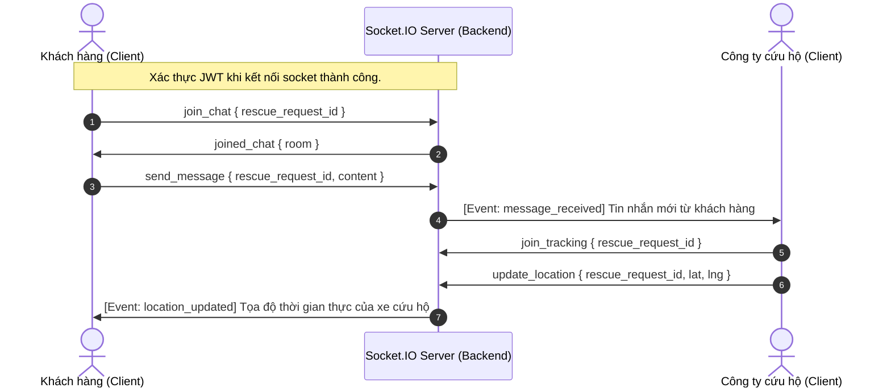

# 🎯 Cấu Trúc Hệ Thống & Thư Mục Dự Án (cuuho247)

Chào mừng bạn đến với tài liệu hướng dẫn cấu trúc dự án **cuuho247** (Road Rescue System). Tài liệu này cung cấp cái nhìn chi tiết và toàn diện về cách tổ chức mã nguồn, kiến trúc các lớp (layers) ở Backend, cách chia các module theo tính năng (features) ở Frontend, các schema cơ sở dữ liệu (Mongoose) và luồng đi của dữ liệu.

---

## 📁 Cấu Trúc Tổng Quan Dự Án

Thư mục gốc chứa hai dự án chính: `backend` và `frontend`, cùng các file cấu hình công cụ toàn cục.

```
cuuho247/
├── backend/               ← Mã nguồn API (Node.js/Express + TypeScript)
├── docs/                  ← Thư mục chứa tài liệu dự án
│   ├── CHANGELOG.md       ← Nhật ký thay đổi phiên bản tự động
│   ├── COMMIT_CONVENTION.md ← Quy chuẩn commit tin nhắn Git
│   ├── readme.md          ← Hướng dẫn sử dụng dự án tổng quát
│   └── structure.md       ← Cấu trúc hệ thống & API
├── frontend/              ← Giao diện người dùng (React + TypeScript + MUI)
├── .env.example           ← File cấu hình biến môi trường mẫu của dự án
├── .gitignore             ← Khai báo các file/thư mục Git bỏ qua
├── .husky/                ← Cấu hình Husky quản lý git hooks
├── .prettierrc            ← Quy tắc định dạng code Prettier
├── package.json           ← Cấu hình npm scripts & package toàn cục
└── release-please-config.json

```

---

## 🔧 Cấu Trúc Backend (`backend/`)

Backend được xây dựng bằng **Node.js, Express, TypeScript và MongoDB**. Backend sử dụng kiến trúc phân lớp (Layers) kết hợp chia nhóm thư mục theo các **Module Nghiệp Vụ** (`modules/`) và phần dùng chung (`shared/`).

```
backend/
├── src/
│   ├── app.ts                  ← Cấu hình Express application
│   ├── routes.ts               ← Lắp ráp tất cả Module Routes vào một Router duy nhất
│   ├── server.ts               ← Điểm khởi chạy Server (Express + Socket.IO)
│   │
│   ├── modules/                ← Các module nghiệp vụ tự đóng gói logic
│   │   ├── admin/
│   │   ├── auth/
│   │   ├── community/
│   │   ├── company/
│   │   ├── message/
│   │   ├── notification/
│   │   ├── rescue/
│   │   ├── review/
│   │   ├── service-catalog/
│   │   ├── user/
│   │   └── vehicle/
│   │
│   ├── shared/                 ← Tài nguyên dùng chung giữa các modules
│   │   ├── config/             ← Kết nối database & các hằng số cấu hình
│   │   ├── constants/          ← Các enums, map lỗi tĩnh
│   │   ├── middleware/         ← Middleware bảo mật, check auth, error handling
│   │   ├── models/             ← Toàn bộ Mongoose Schemas (Database Collections)
│   │   └── utils/              ← Hàm tiện ích trợ giúp (JWT, Hash, Geo, Upload)
│   │
│   ├── socket/                 ← Xử lý kết nối Socket.IO real-time
│   │   └── index.ts            ← Socket event handlers & socket auth middleware
│   │
│   ├── scripts/                ← Các script hỗ trợ phát triển (seed dữ liệu, dọn DB)
│   │   ├── clean-db.ts
│   │   ├── db-utils.ts
│   │   └── seed.ts
│   │
│   └── uploads/                ← Lưu trữ các tệp tải lên (ảnh sự cố, giấy phép...)
│
├── package.json                ← Dependencies & scripts của backend
├── tsconfig.json               ← Cấu hình TypeScript compiler
└── tsconfig.build.json         ← Cấu hình TypeScript khi build production
```

### 1. Phân Lớp Kiến Trúc Của Mỗi Module (`backend/src/modules/`)

Mỗi thư mục con trong `modules` đại diện cho một mảng nghiệp vụ riêng biệt. Trong mỗi module, mã nguồn được chia theo các lớp chức năng:

- **`*.route.ts`**: Định nghĩa endpoint API của module đó, liên kết middleware và điều hướng request tới controller tương ứng.
- **`*.controller.ts`**: Lớp xử lý yêu cầu HTTP. Chỉ làm nhiệm vụ bóc tách dữ liệu (`req.body`, `req.query`, `req.params`), kiểm tra tính hợp lệ cơ bản và gọi Service xử lý. Không chứa logic nghiệp vụ phức tạp.
- **`*.service.ts`**: Nơi xử lý **Business Logic (Logic Nghiệp Vụ)** chính. Thực hiện tính toán, kiểm tra quyền truy cập sâu, điều phối công việc và gọi Repository để tương tác với Database.
- **`*.repository.ts`**: Lớp tương tác trực tiếp với cơ sở dữ liệu sử dụng Mongoose Model. Đảm nhận các thao tác CRUD và các câu lệnh truy vấn MongoDB. Tách biệt hoàn toàn phần DB query ra khỏi Logic nghiệp vụ.
- **`*.validator.ts`**: Chứa các schema validation (bằng Joi hoặc Zod) để kiểm tra tính hợp lệ của dữ liệu đầu vào trước khi xử lý.
- **`*.subscriber.ts`** / **`*.event.ts`**: Xử lý các sự kiện bất đồng bộ trong hệ thống (sử dụng Event Emitters).

### 2. Danh Sách Các Module Nghiệp Vụ Backend

- **[admin](./backend/src/modules/admin)**: Quản lý và kiểm duyệt các đơn vị cứu hộ, người dùng, báo cáo chất lượng dịch vụ, và nhật ký hoạt động hệ thống.
- **[auth](./backend/src/modules/auth)**: Xử lý đăng ký cho Khách hàng (`customer-register`), Công ty cứu hộ (`company-register`), và đăng nhập đa vai trò (`login`).
- **[community](./backend/src/modules/community)**: Tính năng diễn đàn xã hội (tạo bài viết, thích bài viết, bình luận, chia sẻ thông tin sự cố).
- **[company](./backend/src/modules/company)**: Quản lý hồ sơ công ty cứu hộ, thay đổi thông tin hoạt động, upload giấy phép kinh doanh.
- **[message](./backend/src/modules/message)**: Xử lý gửi tin nhắn văn bản, tin nhắn hình ảnh giữa Khách hàng và Công ty cứu hộ trong một yêu cầu cứu hộ cụ thể.
- **[notification](./backend/src/modules/notification)**: Hệ thống thông báo trong ứng dụng cho người dùng khi có thay đổi trạng thái cứu hộ, bài viết, hoặc tin nhắn mới.
- **[rescue](./backend/src/modules/rescue)**: Trọng tâm của hệ thống. Chia thành hai dịch vụ:
  - `customer.service.ts`: Xử lý tạo yêu cầu cứu hộ, tìm kiếm công ty gần nhất dựa trên tọa độ GPS, hủy yêu cầu cứu hộ.
  - `company.service.ts`: Công ty tiếp nhận yêu cầu, cập nhật tiến trình di chuyển (`start`, `arrive`), hoàn thành yêu cầu cứu hộ.
- **[review](./backend/src/modules/review)**: Đánh giá chất lượng dịch vụ (ratings) từ khách hàng và phản hồi của công ty cứu hộ.
- **[service-catalog](./backend/src/modules/service-catalog)**: Quản lý danh mục dịch vụ cứu hộ (như kéo xe, vá vỏ, kích bình) và giá cả mà công ty đăng ký cung cấp.
- **[user](./backend/src/modules/user)**: Quản lý thông tin tài khoản cá nhân, cập nhật hồ sơ khách hàng.
- **[vehicle](./backend/src/modules/vehicle)**: Quản lý phương tiện cứu hộ của các đơn vị (xe cẩu, xe kéo, thông tin biển số...).

---

## 🎨 Cấu Trúc Frontend (`frontend/`)

Frontend được xây dựng bằng **React, TypeScript, Material-UI (MUI)** và quản lý bằng **Vite**. Các components và giao diện trang được tổ chức rõ ràng theo **Chức Năng (Features)**.

```
frontend/
├── src/
│   ├── main.tsx                ← Entry point của ứng dụng React
│   ├── App.tsx                 ← Component gốc, quản lý Routing & Global Providers
│   ├── index.css               ← Định nghĩa style toàn cục và custom CSS
│   ├── theme.ts                ← Cấu hình MUI Theme (màu sắc, typography, component styling)
│   ├── vite-env.d.ts           ← Khai báo kiểu dữ liệu môi trường cho Vite
│   │
│   ├── components/             ← Các component UI chia nhỏ theo tính năng
│   │   ├── admin/              ← Bảng điều khiển admin, danh sách duyệt
│   │   ├── auth/               ← Form đăng nhập, đăng ký
│   │   ├── chat/               ← Cửa sổ tin nhắn, danh sách chat
│   │   ├── common/             ← UI dùng chung (Button, Modal, Input, Loading...)
│   │   ├── community/          ← Bài đăng diễn đàn, bình luận
│   │   ├── customer/           ← Form tạo cứu hộ, đánh giá
│   │   ├── layout/             ← Header, Sidebar, Footer layout chung
│   │   ├── location/           ← Tìm kiếm địa chỉ tự động, bản đồ tương tác
│   │   ├── rescue-company/     ← Quản lý dịch vụ, xe cứu hộ của công ty
│   │   └── rescue-customer/    ← Theo dõi cứu hộ của khách hàng
│   │
│   ├── pages/                  ← Các trang chính của hệ thống (lắp ráp từ components)
│   │   ├── admin/
│   │   ├── auth/
│   │   ├── chat/
│   │   ├── community/
│   │   ├── customer/
│   │   ├── rescue-company/
│   │   ├── shared/
│   │   ├── HomePage.tsx
│   │   └── ShowcasePage.tsx
│   │
│   ├── routes/                 ← Quản lý các cấu hình định tuyến (React Router)
│   │   ├── AdminRoutes.tsx
│   │   ├── ChatRoutes.tsx
│   │   ├── CommunityRoutes.tsx
│   │   ├── CompanyRoutes.tsx
│   │   ├── CustomerRoutes.tsx
│   │   ├── RegisterRoutes.tsx
│   │   └── RescueRoutes.tsx
│   │
│   ├── services/               ← Lớp gọi API HTTP (sử dụng Axios) tới Backend
│   │   ├── admin.service.ts
│   │   ├── auth.service.ts
│   │   ├── community.service.ts
│   │   ├── company.service.ts
│   │   ├── company-rescue.service.ts
│   │   ├── customer-rescue.service.ts
│   │   ├── http.ts
│   │   ├── location.service.ts
│   │   ├── message.service.ts
│   │   ├── notification.service.ts
│   │   ├── review.service.ts
│   │   ├── service.service.ts
│   │   ├── user.service.ts
│   │   └── vehicle.service.ts
│   │
│   ├── hooks/                  ← Các React custom hooks xử lý logic và local state
│   │   ├── useAccountStatusActions.ts
│   │   ├── useAddressSearch.ts
│   │   ├── useCompanyReviews.ts
│   │   ├── useCurrentLocation.ts
│   │   ├── useCustomerRegister.ts
│   │   ├── useLogin.ts
│   │   ├── useRescueRequest.ts
│   │   ├── useServiceDetail.ts
│   │   ├── useServiceForm.ts
│   │   └── useServiceList.ts
│   │
│   ├── utils/                  ← Các hàm trợ giúp xử lý định dạng, kết nối Socket
│   │   ├── companyFormHelper.ts
│   │   ├── date.ts
│   │   ├── format.ts
│   │   ├── socket.ts
│   │   └── url.ts
│   │
│   └── types/                  ← Định nghĩa TypeScript Interfaces cho toàn hệ thống
│       ├── auth.type.ts
│       ├── common.type.ts
│       ├── message.type.ts
│       ├── rescue.type.ts
│       ├── service.type.ts
│       └── vehicle.type.ts
│
├── package.json                ← Dependencies & scripts của frontend
├── vite.config.ts              ← Cấu hình công cụ Vite
└── vercel.json                 ← Cấu hình hosting trên Vercel
```

---

## 🗄️ Cơ Sở Dữ Liệu (Mongoose Models)

Toàn bộ các Mongoose Model được tập trung tại `backend/src/shared/models/`. Hệ thống sử dụng MongoDB làm CSDL chính.

| Model                      | File Mẫu                                                                                   | Mô Tả Chức Năng                                                                                                                                                                                                                                                                        |
| :------------------------- | :----------------------------------------------------------------------------------------- | :------------------------------------------------------------------------------------------------------------------------------------------------------------------------------------------------------------------------------------------------------------------------------------- |
| **`User`**                 | [User.model.ts](./backend/src/shared/models/User.model.ts)                                 | Chứa thông tin người dùng cá nhân (khách hàng), thông tin liên hệ, avatar, mật khẩu băm, và trạng thái tài khoản.                                                                                                                                                                      |
| **`Company`**              | [Company.model.ts](./backend/src/shared/models/Company.model.ts)                           | Thông tin chi tiết về đơn vị cứu hộ bao gồm tên công ty, giấy phép kinh doanh, số điện thoại khẩn cấp, tọa độ định vị công ty, bán kính hoạt động, loại sự cố hỗ trợ, và trạng thái duyệt (`pending`, `approved`, `rejected`, `locked`).                                               |
| **`Admin`**                | [Admin.model.ts](./backend/src/shared/models/Admin.model.ts)                               | Tài khoản quản trị viên hệ thống để đăng nhập và truy cập trang quản trị.                                                                                                                                                                                                              |
| **`Vehicle`**              | [Vehicle.model.ts](./backend/src/shared/models/Vehicle.model.ts)                           | Quản lý đội xe cứu hộ của từng công ty (biển số, loại xe cẩu/kéo, trạng thái hoạt động).                                                                                                                                                                                               |
| **`ServiceCategory`**      | [ServiceCategory.model.ts](./backend/src/shared/models/ServiceCategory.model.ts)           | Các danh mục sự cố hệ thống hỗ trợ (Vá lốp, Kéo xe, Hỏng máy, Hết bình điện...).                                                                                                                                                                                                       |
| **`Service`**              | [Service.model.ts](./backend/src/shared/models/Service.model.ts)                           | Các dịch vụ cụ thể mà từng công ty cung cấp cùng giá bán tương ứng.                                                                                                                                                                                                                    |
| **`RescueRequest`**        | [RescueRequest.model.ts](./backend/src/shared/models/RescueRequest.model.ts)               | Lưu vết cuộc cứu hộ. Chứa thông tin khách hàng, đơn vị tiếp nhận, loại sự cố, tọa độ gặp nạn, hình ảnh hiện trường, nhật ký đổi trạng thái (`pending`, `accepted`, `in_progress`, `arrived`, `completed`, `cancelled`, `rejected`), thông tin thanh toán, và xe cứu hộ được phân công. |
| **`Message`**              | [Message.model.ts](./backend/src/shared/models/Message.model.ts)                           | Lưu trữ nội dung tin nhắn chat (văn bản/hình ảnh) giữa hai bên trong tiến trình cứu hộ.                                                                                                                                                                                                |
| **`Review`**               | [Review.model.ts](./backend/src/shared/models/Review.model.ts)                             | Lưu trữ đánh giá của khách hàng (số sao, nhận xét) cho công ty cứu hộ và phản hồi của công ty.                                                                                                                                                                                         |
| **`Notification`**         | [Notification.model.ts](./backend/src/shared/models/Notification.model.ts)                 | Lưu trữ lịch sử thông báo hệ thống gửi cho người dùng.                                                                                                                                                                                                                                 |
| **`CommunityPost`**        | [CommunityPost.model.ts](./backend/src/shared/models/CommunityPost.model.ts)               | Bài đăng thảo luận của cộng đồng trên diễn đàn.                                                                                                                                                                                                                                        |
| **`CommunityPostComment`** | [CommunityPostComment.model.ts](./backend/src/shared/models/CommunityPostComment.model.ts) | Bình luận của bài đăng cộng đồng.                                                                                                                                                                                                                                                      |
| **`CommunityPostLike`**    | [CommunityPostLike.model.ts](./backend/src/shared/models/CommunityPostLike.model.ts)       | Lưu trữ lượt thích (like) của người dùng đối với các bài đăng.                                                                                                                                                                                                                         |
| **`AdminLog`**             | [AdminLog.model.ts](./backend/src/shared/models/AdminLog.model.ts)                         | Lưu lại vết hoạt động thao tác của quản trị viên (ví dụ: Khóa tài khoản, phê duyệt công ty).                                                                                                                                                                                           |

---

## 📡 Bản Đồ API Endpoints

Hệ thống API RESTful của Backend được cấu trúc thống nhất với tiền tố `/api`. Dưới đây là danh sách chi tiết các endpoints theo từng Route File:

### 1. Xác thực & Đăng nhập (`/api/auth`)

- `POST /auth/customer-register` - Đăng ký tài khoản khách hàng.
- `POST /auth/company-register` - Đăng ký tài khoản doanh nghiệp cứu hộ (kèm tệp giấy phép).
- `POST /auth/login` - Đăng nhập tài khoản hệ thống (khách hàng, công ty, admin).

### 2. Người dùng (`/api/users`)

- `GET /users/me` - Xem thông tin tài khoản đang đăng nhập.
- `PUT /users/me` - Cập nhật thông tin cá nhân & tải lên avatar mới.

### 3. Công ty & Dịch vụ (`/api/company` và `/api/service-categories`)

- `GET /company/profile/me` - Xem hồ sơ công ty cứu hộ đang đăng nhập.
- `PUT /company/profile` - Cập nhật thông tin công ty cứu hộ.
- `GET /company/:companyId` - Lấy thông tin công ty theo ID.
- `GET /service-categories` - Lấy toàn bộ danh mục sự cố hệ thống.
- `GET /company/services` - Lấy danh sách dịch vụ của công ty đang hoạt động.
- `POST /company/services/new` - Đăng ký thêm dịch vụ mới cho công ty.
- `PUT /company/services/:serviceId` - Sửa đổi dịch vụ của công ty.
- `DELETE /company/services/:serviceId/delete` - Xóa dịch vụ của công ty.

### 4. Quản lý Đội Xe (`/api/vehicles`)

- `GET /vehicles` - Lấy danh sách xe của công ty cứu hộ.
- `GET /vehicles/:id` - Xem chi tiết một xe cứu hộ.
- `POST /vehicles` - Thêm mới phương tiện cứu hộ vào đội.
- `PATCH /vehicles/:id` - Cập nhật thông tin phương tiện.
- `DELETE /vehicles/:id` - Xóa phương tiện khỏi hệ thống.

### 5. Yêu Cầu Cứu Hộ (`/api/rescue`)

- `GET /rescue/companies` - Tìm kiếm đơn vị cứu hộ gần tọa độ GPS của khách hàng.
- `POST /rescue/requests` - Khách hàng gửi yêu cầu cứu hộ mới.
- `GET /rescue/requests/my-requests` - Khách hàng xem lịch sử yêu cầu của mình.
- `PATCH /rescue/requests/:id/cancel` - Khách hàng hủy yêu cầu cứu hộ đang chờ.
- `GET /rescue/company/pending` - Công ty xem các yêu cầu đang chờ tiếp nhận.
- `PATCH /rescue/company/pending/:requestId/accept` - Công ty chấp nhận yêu cầu cứu hộ.
- `GET /rescue/company/active` - Công ty xem yêu cầu đang xử lý hiện tại.
- `PATCH /rescue/company/active/:requestId/start` - Công ty bắt đầu di chuyển cứu hộ.
- `PATCH /rescue/company/active/:requestId/arrive` - Công ty đã đến hiện trường sự cố.
- `PATCH /rescue/company/active/:requestId/complete` - Công ty hoàn thành ca cứu hộ.
- `GET /rescue/company/active/:requestId` - Chi tiết yêu cầu cứu hộ đang thực hiện.
- `GET /rescue/company/completed` - Danh sách yêu cầu đã hoàn thành của công ty.
- `GET /rescue/company/canceled` - Danh sách yêu cầu đã bị hủy của công ty.
- `GET /rescue/company/requests/:requestId/route` - Lấy thông tin ước tính tuyến đường từ bản đồ.

### 6. Đánh giá chất lượng (`/api/ratings`)

- `POST /ratings` - Khách hàng đánh giá đơn vị sau khi hoàn thành.
- `GET /ratings/company/:companyId` - Lấy danh sách đánh giá của một công ty.
- `GET /ratings/request/:requestId` - Xem đánh giá dựa trên ID ca cứu hộ.
- `PATCH /ratings/:id/reply` - Đơn vị cứu hộ viết phản hồi đánh giá.

### 7. Trò chuyện trực tiếp (`/api/messages`)

- `GET /api/messages/:rescueRequestId` - Lấy lịch sử tin nhắn của cuộc cứu hộ.
- `POST /api/messages/:rescueRequestId/image` - Gửi tin nhắn chứa hình ảnh hiện trường.

### 8. Quản trị viên (`/api/admin`)

- `GET /admin/companies/pending` - Xem danh sách công ty đang chờ duyệt hồ sơ.
- `PATCH /admin/companies/:companyId/approve` - Phê duyệt công ty hoạt động.
- `PATCH /admin/companies/:companyId/reject` - Từ chối phê duyệt hồ sơ doanh nghiệp.
- `GET /admin/users` - Danh sách tất cả khách hàng trên hệ thống.
- `PATCH /admin/users/:userId/lock` - Khóa tài khoản khách hàng vi phạm.
- `GET /admin/logs` - Xem nhật ký hoạt động hệ thống.
- `GET /admin/reports/rescue-activities` - Báo cáo thống kê hoạt động cứu hộ toàn hệ thống.

---

## ⚡ Socket.IO Events & Luồng Giao Tiếp Real-time

Các kết nối thời gian thực (real-time) được quản lý qua Socket.IO tại tập tin [index.ts](./backend/src/socket/index.ts).



### Các sự kiện phía Client gửi lên (Listen on Server)

1.  **`join_chat`**: Đăng ký tham gia vào phòng chat của một yêu cầu cứu hộ cụ thể.
2.  **`send_message`**: Gửi tin nhắn mới (văn bản). Server sẽ lưu tin nhắn qua repository và phát tín hiệu cho phòng chat tương ứng.
3.  **`mark_read`**: Đánh dấu đã đọc toàn bộ tin nhắn đối phương gửi.
4.  **`join_tracking`**: Đăng ký tham gia phòng theo dõi vị trí GPS cho ca cứu hộ.
5.  **`update_location`**: Đơn vị cứu hộ định kỳ gửi tọa độ GPS mới của xe để Server phát lại cho khách hàng theo dõi.

### Các sự kiện Server phát đi (Emit to Client)

1.  **`joined_chat`**: Phản hồi xác nhận đã tham gia phòng chat thành công.
2.  **`messages_read`**: Thông báo cho đối phương biết tin nhắn đã được đọc.
3.  **`location_updated`**: Gửi tọa độ GPS thời gian thực của xe cứu hộ cho khách hàng xem trên bản đồ Leaflet.
4.  **`error`**: Phát đi các thông báo lỗi xác thực hoặc quyền truy cập.
